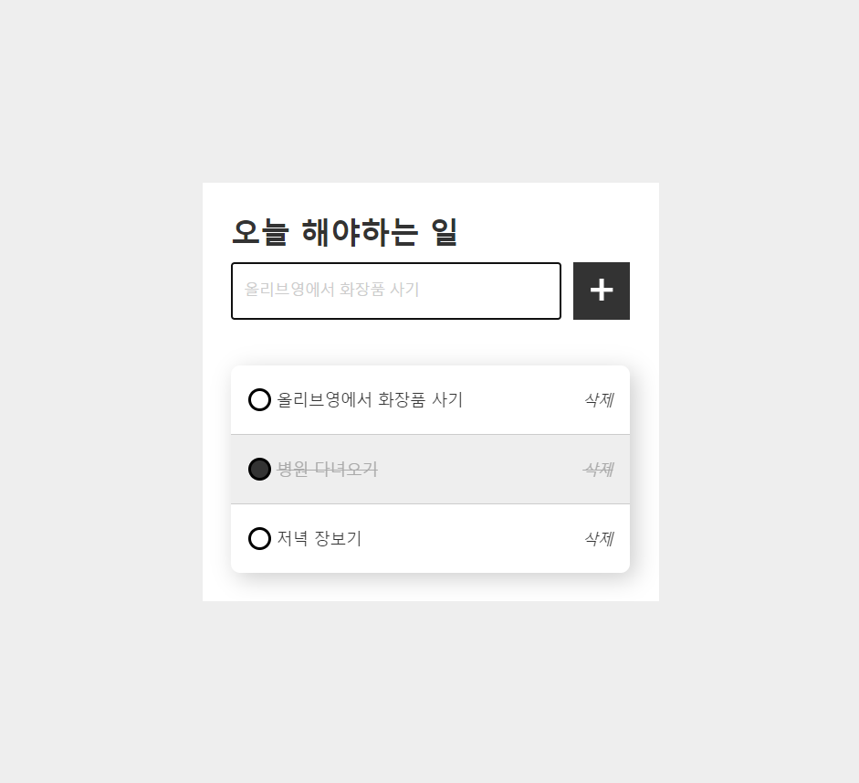

# TO-DO LIST

투 두 리스트를 바닐라 자바스크립트로 구현한다

## functions

1. 입력창에 글자를 입력하고 추가하면 리스트에 일정이 추가된다
2. checkbox를 클릭하면 완료된 일정 스타일로 변경된다
3. 삭제 버튼을 클릭하면 리스트에서 일정이 삭제된다

## challenge

- 시맨틱 마크업을 작성함
- 중복 사용 중이거나, 중복 사용될 여지가 높은 로직은 함수화하여 편의성을 증가시킴
